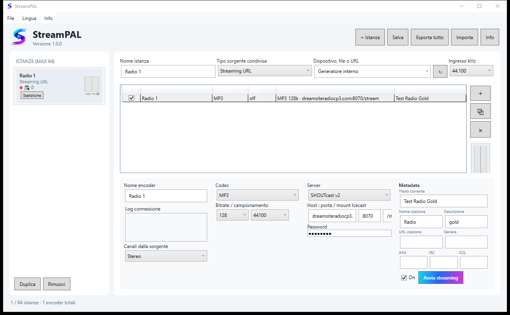

# StreamPAL 1.0.0


Native modular broadcast encoder for Windows and Ubuntu Studio 26.04 LTS. StreamPAL supports up to 64 independent source instances; every instance can feed multiple encoders with different codecs, bitrates, channels, metadata and destination servers.

> Private project — Copyright © Freewaves. All rights reserved.

## Screenshot



## Italiano

StreamPAL trasmette audio reale verso server Icecast 2 e SHOUTcast. Ogni istanza utilizza una sorgente audio unica e la distribuisce a più encoder indipendenti.

- Sorgenti Windows: WASAPI, DirectSound, ASIO, file, URL e generatore di test.
- Sorgenti Linux: PipeWire/JACK, file, URL e generatore di test.
- Codec: MP3, AAC-LC, AAC+/HE-AAC, OGG Vorbis e Opus.
- Selezione stereo, solo sinistro, solo destro o mono L+R.
- Bitrate e campionamento configurabili.
- Metadata distinti per ogni encoder.
- Riconnessione automatica, log in tempo reale, ascoltatori e statistiche fino a 72 ore.
- Esportazione configurazione e statistiche; avvio automatico con il sistema.
- Interfaccia disponibile in italiano, inglese, spagnolo e francese.

Installer: `outputs/StreamPAL-Setup-1.0.0.exe` per Windows e `outputs/StreamPAL_1.0.0_amd64.deb` per Ubuntu Studio.

## English

StreamPAL sends live audio to Icecast 2 and SHOUTcast servers. Each source instance can feed several independent encoders with separate formats, metadata and destinations.

Features include Windows and Linux audio inputs, MP3/AAC/HE-AAC/Ogg/Opus, channel routing, configurable bitrate and sample rate, automatic reconnection, live connection logs, listener statistics, configuration import/export and system startup options. The interface is available in Italian, English, Spanish and French.

## Español

StreamPAL transmite audio en directo a servidores Icecast 2 y SHOUTcast. Cada instancia usa una fuente única y puede alimentar varios codificadores independientes con formatos, metadatos y destinos diferentes.

Incluye MP3, AAC, HE-AAC, OGG y Opus, selección de canales, bitrate y muestreo configurables, reconexión automática, registro en tiempo real, estadísticas de oyentes, importación/exportación de configuraciones e inicio automático. La interfaz está disponible en italiano, inglés, español y francés.

## Français

StreamPAL diffuse l’audio en direct vers Icecast 2 et SHOUTcast. Chaque instance utilise une source unique et peut alimenter plusieurs encodeurs indépendants avec des formats, métadonnées et destinations différents.

Fonctions principales : MP3, AAC, HE-AAC, OGG et Opus, sélection des canaux, débit et échantillonnage configurables, reconnexion automatique, journal en temps réel, statistiques d’audience, import/export de la configuration et démarrage automatique. L’interface est disponible en italien, anglais, espagnol et français.

## Build

Windows:

```powershell
dotnet publish src/StreamForge.App/StreamForge.App.csproj -c Release -r win-x64 --self-contained true
```

Linux:

```bash
dotnet publish src/StreamPAL.Linux/StreamPAL.Linux.csproj -c Release -r linux-x64 --self-contained true
```

## Contact

[www.freewaves.it](https://www.freewaves.it) — max@freewaves.it
